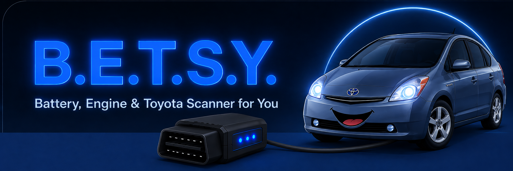
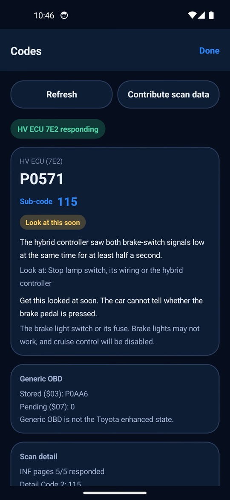

# B.E.T.S.Y.

**Battery, Engine & Toyota Scanner for You**

### Reads and explains Toyota INF diagnostic sub-codes. Open source. Runs on a $3.50 adapter.
### Looking for captures from real Toyota hybrids.

## See it run

A scan on a 2009 Prius, from picking the adapter through to the codes and their sub-codes. Sped up
through the connection wait, no audio.

<video src="https://github.com/alrighdee/BETSY/raw/main/docs/assets/betsy-demo.mp4" width="320" controls muted playsinline></video>

[Download the clip](docs/assets/betsy-demo.mp4) if the player does not load.

## Volunteers wanted: two minutes with your hybrid

**Every capture helps, and it takes about two minutes.** Any Prius from roughly 2004 to 2015. You
do not need to know anything about your car beyond that; the app works the rest out itself.

**Car with the triangle on? This is the scan the project needs most.** A stored code such as
`P0AA6`, `P3000` or `P3019` exercises the detail path that a healthy car cannot. It may confirm a
new fault, vehicle layout or multi-fault combination. Please do send it.

**Car perfectly healthy? Send it too.** Not a consolation prize: healthy captures are the control
group. They prove the read works across different adapters, firmware and model years, and they are
what lets a faulty car's all-zero table be read as a real result rather than a failed read. They
just cannot do the job a faulty car does.

**2010-2015 Prius?** Especially wanted. That generation is written and tested against recorded
data, but the app has never met an actual one. Yours would be the first.

1. **[Install the app](https://github.com/alrighdee/BETSY/releases/latest)**
2. Connect your ELM327 adapter
3. Open **DTC / INF codes** and let the scan finish
4. Tap **Contribute scan data**

No account, no sign-up, no typing hex into a forum post. The app shows you exactly what it will
send before it sends anything, and everything it does is a read: it never clears a code, runs an
actuator test, or writes to an ECU.

### Why this is needed

The repair manuals tell us what the sub-codes *mean*. `P0AA6` with one sub-code is a battery-area
problem; with another it points at the A/C compressor circuit. BETSY also knows where a Gen2 Prius
transmits that value: bytes 29–30 of a diagnostic freeze page on the hybrid-control ECU.

That field has been confirmed on a Gen2 carrying `P0571-115`. BETSY reads all five pages, retains
the raw responses, and explains a value only when it matches a documented DTC/sub-code pair. On a
multi-fault car it does not infer ownership from page order, and an ambiguous combination remains
unresolved instead of becoming a guessed diagnosis.

More captures still matter. Faulty cars validate different codes and combinations; healthy cars
prove the same read works across adapters, firmware and model years. The decoder, app and evidence
are open source, so hybrid owners can read the result with an ordinary adapter.

---

## FAQ

### What is BETSY?

An Android app that reads hybrid battery data and trouble codes from Toyota hybrids using an
ordinary ELM327 adapter. No dealer tool, no proprietary cable, no subscription.

### Which cars work?

| Car | Status |
|---|---|
| Prius, 2004-2009 | Confirmed on a stock US-market 2009 car |
| Prius, 2010-2015 | Implemented, never yet run against a real one |
| Prius, 2016 onwards | Detected and reported as unsupported, rather than silently mis-decoded |
| Prius, 2001-2003 | Detected and reported as unsupported |

You do not need to identify your car. The app probes it and works out how to talk to it.

Your capture will name a **protocol layout**, not a car: "Gen2, battery on 7E3", "Gen2, battery on
7E2", or "Gen3". That is a statement about which ECU answered, not about which generation you own.

Two cars of the same year can answer on different ECUs, so the app tries one and falls back to the
other rather than guessing from the year.

**If your car answers in a way BETSY has not seen before**, it says so and turns off live battery
readings rather than showing you numbers it cannot stand behind. Codes and the raw tables are still
read, and sharing that scan is exactly what would add proper support for your car. That is the most
valuable capture of all: it is the only way a new variant ever gets supported.

Other Toyota and Lexus hybrids of the same era may work, since detection is by protocol rather
than by badge, but none have been tested. A capture from one would settle it.

### What does it read?

- **Live pack data**: state of charge, pack current, per-block voltages, internal resistance,
  auxiliary battery, temperatures, charge and discharge limits
- **Trouble codes**: separate hybrid-control, battery-control and engine observations on Gen2
- **INF sub-codes and freeze pages**: all five pages read from the hybrid-control ECU, with known
  DTC/sub-code pairs explained in plain language

### Will it change anything on my car?

No. Every command it sends is a read. It never clears a code, never runs an actuator test, and
never writes to an ECU. If you want to verify that rather than take my word for it, the wire
commands are listed in [the protocol notes](docs/PROTOCOL.md) and the source is here.

### What do I need?

An Android phone on 8.0 or newer, and an ELM327 adapter. A $3.50 Bluetooth clone is fine; that is
what the app was developed against. Wi-Fi adapters work too.

### How do I connect?

1. Plug the adapter into the OBD2 socket. On a Gen2 Prius that is under the dash, just left of the
   steering column.
2. Pair it in Android's Bluetooth settings first. The PIN is usually `1234` or `0000`.
3. Press the power button twice with your foot on the brake so the car reads READY.
4. Open BETSY and pick your adapter from the list.

Android will warn you about installing an APK from outside the store. That is expected for
anything not distributed through Google Play, and you only have to allow it once.

### Does it tell me the sub-code?

Yes, on the confirmed Gen2 path. BETSY reads the transmitted INF value and explains documented
DTC/sub-code pairs. If a value is unknown or could belong to more than one reported DTC, the raw
value remains visible and BETSY does not guess.

`P0571` with its sub-code, what the controller actually saw, and what to look at first.

### What gets uploaded when I share a scan?

- The raw diagnostic responses from the hybrid-control, battery-control and engine reads
- App version and build, detected vehicle layout, adapter model
- A short extract of that session's diagnostic log
- Anything you type in the notes field
- Your IP address, briefly, and only to rate-limit abuse

Not sent: VIN, location, or any device or account identifier. The app shows you this before it
sends anything, and captures are committed publicly to
[`captures/`](https://github.com/alrighdee/BETSY/tree/main/captures) so you can see exactly what
arrived.

### Where does the upload go?

To a small Cloudflare Worker that commits the capture into this repository. Its
[full source](cloudflare-worker/src/index.ts) is here, so you can read exactly what happens to
your data rather than trust a description of it.

### Can I build it myself?

Yes, see [Developing](docs/DEVELOPING.md). Releases are cut from CI and the APK is attached to
each tag.

### Can I help without a car?

Yes. The protocol notes, the decoder and the capture pipeline all take review, and
[Contributing](CONTRIBUTING.md) covers how the project works.

---

## Going deeper

| Document | What's in it |
|---|---|
| [Glossary](docs/GLOSSARY.md) | What a DTC, INF sub-code, freeze frame and ECU actually are. Start here if the rest reads like alphabet soup |
| [Developing](docs/DEVELOPING.md) | Building from source, project layout, notes on adapters |
| [Protocol](docs/PROTOCOL.md) | The wire spec. Read it before touching a decoder, the code cites its section numbers |
| [Contributing](CONTRIBUTING.md) | Commit conventions, how releases are cut, what is in scope |

## Not affiliated with Toyota

BETSY is an independent project, not affiliated with, endorsed by, or supported by Toyota Motor
Corporation. "Toyota", "Prius" and "Lexus" are their trademarks, named here only to say which
vehicles the app can read.

## Licence

MIT. No warranty. Test on your own vehicle, at your own risk.
